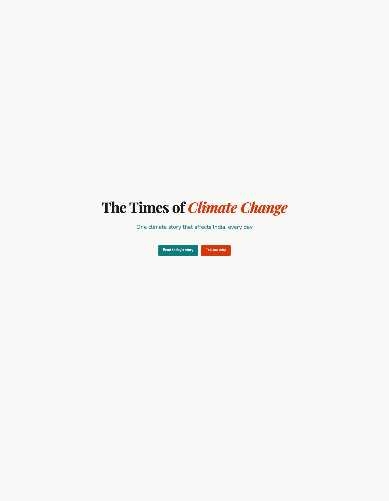
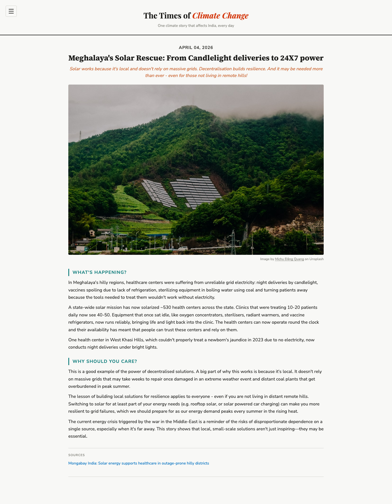

# The Times of Climate Change — Share Deck

_A simple deck to send to climate-minded friends and influencers, asking them to share TOCC with their networks._

---

## Slide 1 — Title

# The Times of Climate Change

### A daily climate story for India — in plain English, connected to your life.

One story a day. No jargon. No doom-scrolling.

🔗 [site link] · 💬 [WhatsApp channel link]

---

## Slide 2 — The problem

**Most climate news in India is one of three things:**

- **Too distant** — melting glaciers, 2100 projections, COP summits in other countries
- **Too doom-y** — headlines that make you close the tab
- **Too jargon-heavy** — NDCs, mitigation, adaptation, gigatonnes, net-zero pathways

Meanwhile, the climate crisis is already here — in your wheat, your water bill, your April heat, your kid's asthma.

**The gap isn't information. It's sense-making.**

---

## Slide 3 — What TOCC is

Every day, we pick **one** story — and connect it to your daily life in India.

Not *"climate change is real."*
But *this year's wheat price, your April power cut, your city's water, the fish on your plate.*

Two sections. Always.

1. **What are we talking about?**
2. **Why should you care?**

No 1000-word essays. No PhD required. 3-minute read.

---

## Slide 4 — What it looks like

Clean, readable, no clutter. Built to be read on your phone over morning chai.

---

## Slide 5 — Three recent stories

**🌾 The end of Spring: India jumps straight from Winter to Summer**
Why care: expect higher wheat prices next year.

**⛽ The fuel crisis pushing India in different directions**
Rural India is going back to fuelwood. Urban India is getting on the bus. Same crisis, two very different responses.

**☀️ Meghalaya's solar rescue: from candlelight deliveries to 24×7 power**
Why decentralised solar matters — even if you don't live in a remote hill village.

---

## Slide 6 — Who it's for

English-speaking, news-reading Indians. Roughly **25–45, top 5% income**, living in Mumbai, Delhi, Bangalore, Pune, Hyderabad.

People who:

- Read the news, but feel climate coverage is either boring or overwhelming
- Suspect climate change is already affecting their life — but can't quite connect the dots
- Want to care, but don't know where to start

In short: **the audience that already has influence in India — but hasn't been given climate in a language they'll actually read.**

---

## Slide 7 — Why I'm doing this

I believe the climate crisis is here. It's happening right now. To all of us. Right where we are. And human beings as a whole are acting like the dumbest intelligent species to have existed.

I also believe that most humans *want* to do good things. If they're armed with the right information, in forms they can make sense of, they'll be empowered to make better decisions. **That's the only hope I have of getting us to a better future.**

So that's what I'm trying to do here.

_(Yes, I am a hopeless optimist.)_

— Sailee Rane · Ecosystem Messaging lead, Rainmatter Foundation · ex-consultant · writes [Sunny Climate Stormy Climate](https://sunnyclimatestormyclimate.substack.com/)

---

## Slide 8 — Why I think this will work

**The "connect it to daily life" angle is badly underserved in India.**

Indian climate journalism today is mostly:

- **Policy reporting** — good, but written for experts
- **Disaster coverage** — good, but episodic and fatalistic
- **NGO / think-tank explainers** — good, but too long, too worthy

Almost nobody is doing **daily, human-scale, English-language climate journalism that starts with your life, not the planet.**

That gap is the whole thesis. Fill it with one good story a day, and readers will come — and stay.

---

## Slide 9 — Where we are today

**We're just starting out.** But the early signal is real:

- **29 stories** published · daily cadence, no misses
- **150+** followers on the WhatsApp channel
- **1,500+** page views
- **Zero marketing** — every reader so far has come from someone sharing it with someone else

Which is exactly why I'm sending this to you.

---

## Slide 10 — The ask

**Share it with your network. That's the whole ask.**

If TOCC resonates — forward the site to 3–5 people who'd care, or post it with a line of your own.

A line you can steal if it helps:

> *"Found a daily climate newsletter for India that actually connects the crisis to things I notice — wheat prices, heatwaves, power cuts. One story a day, no jargon. Worth a look: [link]"*

No subscriptions to manage. No product to buy. Just one link, shared with people who trust your taste.

**Thank you. Truly.**

🔗 [site link]
💬 [WhatsApp channel]
✉️ [your email]
